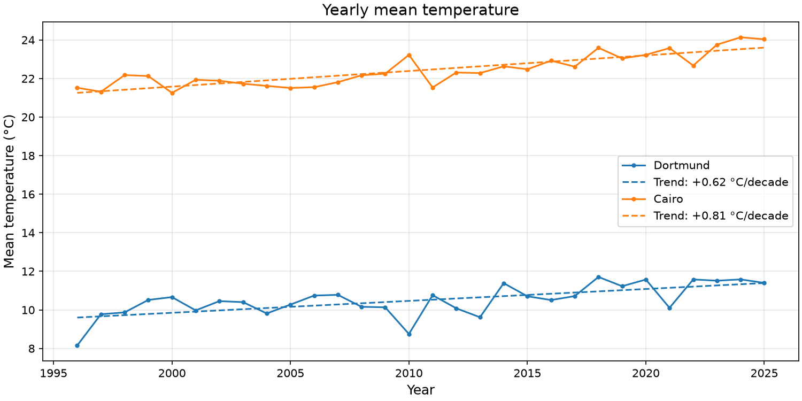
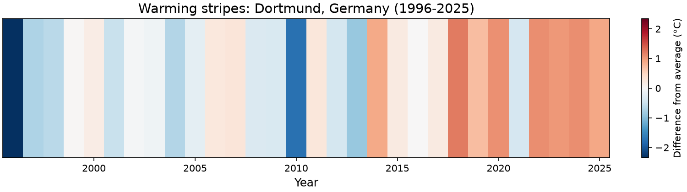
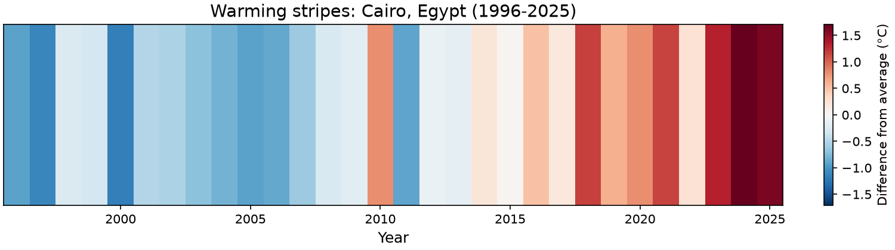
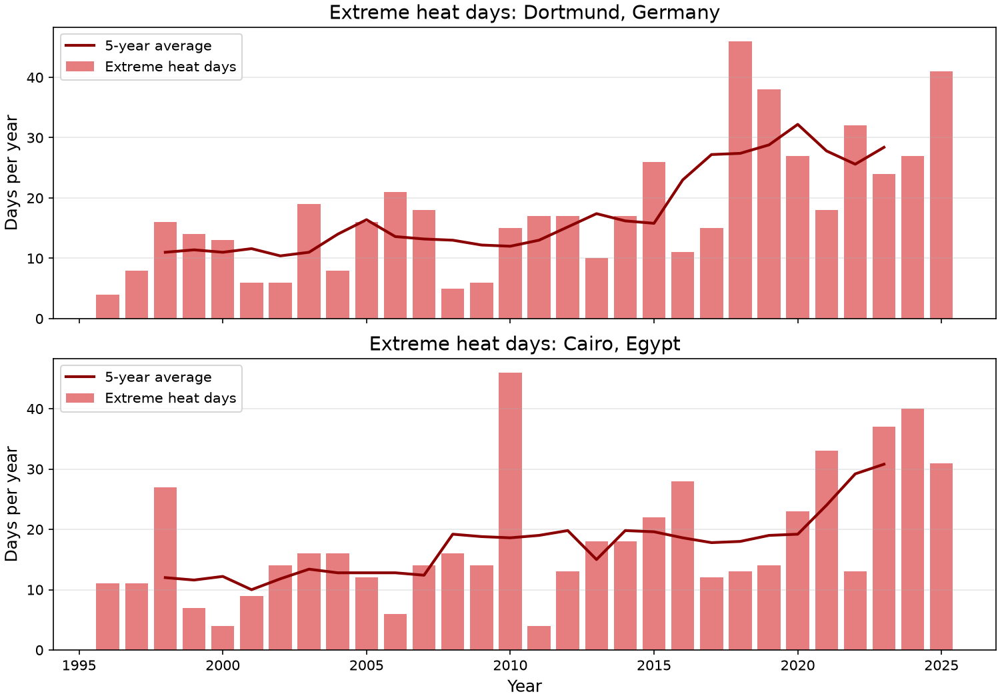
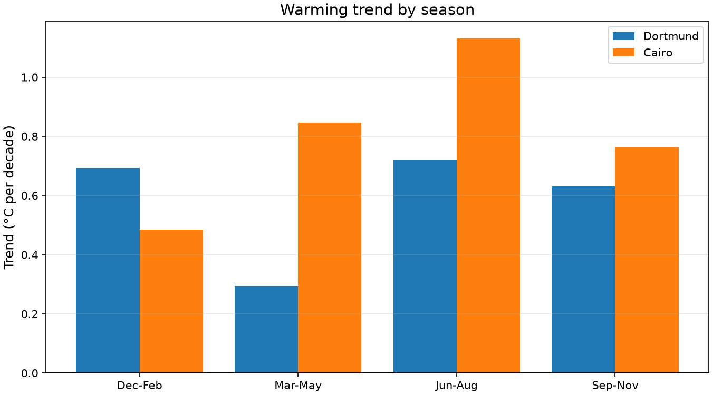
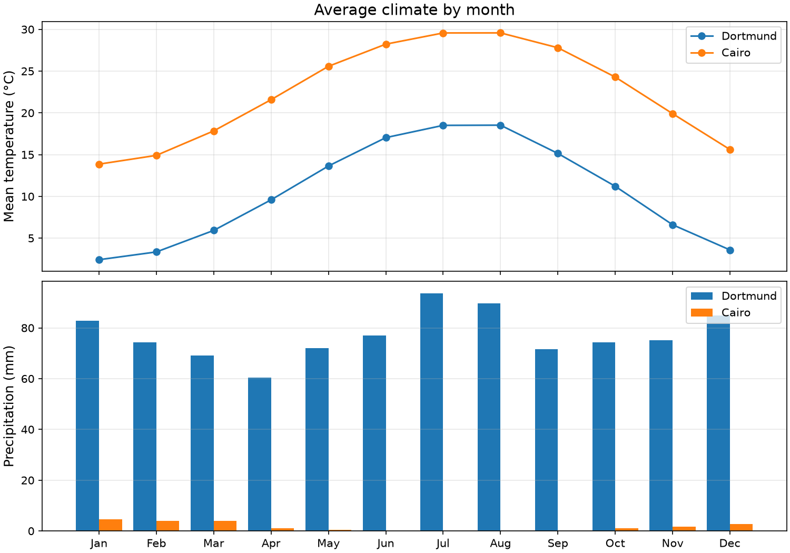

# Climate Insights

Climate Insights is a command-line tool and Python package that downloads decades of historical weather data for any city in the world and analyzes how its climate has changed.

For each city it answers questions like:

- How fast is the city warming, in °C per decade?
- Which were the hottest and coldest years and days?
- Have extreme heat days become more common?
- Which season is warming the fastest?
- How does the city compare to other cities?

The results are printed as a text report with plain-language insights, and saved as plots in the `outputs/` folder.

## Installation

You need [uv](https://docs.astral.sh/uv/) and Python 3.12 or newer.

```bash
git clone https://github.com/MohamedTarek012/climate-insights.git
cd climate-insights
uv venv
uv pip install -e .
```

## Usage

Analyze one city:

```bash
uv run -m climate_insights --city Dortmund
```

Compare several cities:

```bash
uv run -m climate_insights --city Dortmund --compare Cairo
```

### Options

| Option | Description | Default |
|---|---|---|
| `--city CITY` | The city to analyze (required) | |
| `--compare CITY [CITY ...]` | One or more cities to compare with | none |
| `--years N` | Number of complete years to analyze (2-80) | 30 |
| `--output-dir DIR` | Folder for the saved plots | `outputs` |
| `--data-dir DIR` | Folder for downloaded data | `data` |
| `--no-plots` | Only print the text report | off |

Run `uv run -m climate_insights --help` to see all options.

### Example output

Output of `uv run -m climate_insights --city Dortmund --compare Cairo`:

```
Dortmund, Germany (1996-2025)
=============================
  Average temperature:     10.5 °C
  Warming trend:           +0.62 °C per decade
  Hottest year:            2018 (11.7 °C)
  Coldest year:            1996 (8.2 °C)
  Hottest day:             25 Jul 2019 (38.1 °C)
  Coldest day:             07 Jan 2009 (-23.2 °C)
  Yearly precipitation:    925 mm

  1996-2005 vs 2016-2025:
    Mean temperature:      +1.20 °C
    Extreme heat days/yr:  11.0 -> 27.9

  Seasons (mean, trend per decade):
    Dec-Feb:    3.2 °C   +0.69 °C
    Mar-May:    9.7 °C   +0.29 °C
    Jun-Aug:   18.0 °C   +0.72 °C
    Sep-Nov:   11.0 °C   +0.63 °C

  Insights:
    - Dortmund has warmed by about 1.9 °C over the last 30 years.
    - The strongest warming happens in Jun-Aug (+0.72 °C per decade).
    - Extreme heat days are 2.5x as common as in 1996-2005.
    - 5 of the 5 hottest years were in the last ten years.

Cairo, Egypt (1996-2025)
========================
  Average temperature:     22.4 °C
  Warming trend:           +0.81 °C per decade
  Hottest year:            2024 (24.1 °C)
  Coldest year:            2000 (21.3 °C)
  Hottest day:             27 May 2015 (45.3 °C)
  Coldest day:             20 Jan 1996 (2.9 °C)
  Yearly precipitation:    20 mm

  1996-2005 vs 2016-2025:
    Mean temperature:      +1.65 °C
    Extreme heat days/yr:  12.7 -> 24.4

  Seasons (mean, trend per decade):
    Dec-Feb:   14.8 °C   +0.48 °C
    Mar-May:   21.7 °C   +0.85 °C
    Jun-Aug:   29.1 °C   +1.13 °C
    Sep-Nov:   24.0 °C   +0.76 °C

  Insights:
    - Cairo has warmed by about 2.4 °C over the last 30 years.
    - The strongest warming happens in Jun-Aug (+1.13 °C per decade).
    - Extreme heat days are 1.9x as common as in 1996-2005.
    - 5 of the 5 hottest years were in the last ten years.

City comparison
===============================================================================
City                       Mean °C  Trend/decade  Hottest year     Heat days/yr
-------------------------------------------------------------------------------
Dortmund, Germany             10.5         +0.62          2018     11.0 -> 27.9
Cairo, Egypt                  22.4         +0.81          2024     12.7 -> 24.4

Cairo is warming the fastest (+0.81 °C per decade).
```

## Plots

All plots are saved as PNG files in `outputs/`. These are the plots for Dortmund and Cairo:

**Yearly mean temperature with trend lines**



**Warming stripes**: each stripe is one year, colored by how much warmer (red) or colder (blue) it was than the average




**Extreme heat days per year**



**Warming trend by season**



**Average climate by month**



## Using the package in Python

All important classes and functions can be imported directly from `climate_insights`:

```python
from climate_insights import ClimateAnalyzer, WeatherFetcher, find_city, format_report

city = find_city("Dortmund")
data = WeatherFetcher().fetch(city, years=30)  # pandas DataFrame, one row per day

analyzer = ClimateAnalyzer(city, data)
print(analyzer.warming_trend())       # °C per decade
print(analyzer.hottest_year())        # (year, temperature)
print(analyzer.seasonal_summary())    # DataFrame with one row per season
print(format_report(analyzer))        # full text report
```

## How it works

1. **Geocoding**: the city name is converted to coordinates using the [Open-Meteo Geocoding API](https://open-meteo.com/en/docs/geocoding-api).
2. **Downloading**: daily mean, maximum and minimum temperature and precipitation are downloaded from the [Open-Meteo Historical Weather API](https://open-meteo.com/en/docs/historical-weather-api). No API key is needed. The data is saved as CSV in `data/`, so each city is only downloaded once.
3. **Analysis**:
   - The **warming trend** is the slope of a straight line fitted to the yearly mean temperatures (`numpy.polyfit`).
   - A day is an **extreme heat day** if its maximum temperature is above the 95th percentile of all maximum temperatures in the same calendar month. Comparing within each month means the definition works for both hot and cold cities.
   - **Seasons** are meteorological seasons (Dec-Feb, Mar-May, Jun-Aug, Sep-Nov). December is counted towards the following winter.
   - The first ten years are compared with the last ten years.
4. **Output**: a text report is printed and the plots are saved with matplotlib.

## Project structure

```
climate-insights/
├── pyproject.toml
├── README.md
├── outputs/                 # generated plots
└── src/
    └── climate_insights/
        ├── __init__.py      # public API of the package
        ├── __main__.py      # command-line interface
        ├── geocoding.py     # city name -> coordinates
        ├── fetcher.py       # downloading and caching weather data
        ├── analysis.py      # ClimateAnalyzer: all statistics
        ├── report.py        # text reports and insights
        └── plotting.py      # plots saved as PNG
```

## Data source

Weather data by [Open-Meteo.com](https://open-meteo.com/), based on reanalysis data. The data is modeled, so single days can differ slightly from local weather station measurements.
